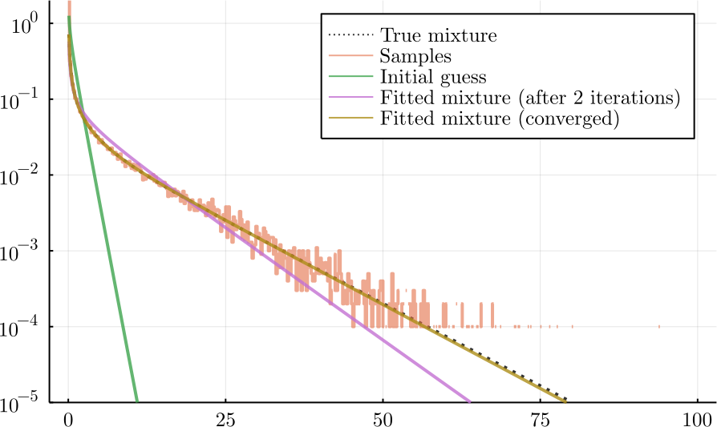

# ExpectationMaximization

[](https://dmetivie.github.io/ExpectationMaximization.jl/dev)

This package provides a simple implementation of the Expectation Maximization (EM) algorithm used to fit mixture models.
Due to [Julia](https://julialang.org/) amazing [dispatch](https://www.youtube.com/watch?v=kc9HwsxE1OY) systems, generic and reusable code spirit, and the [Distributions.jl](https://juliastats.org/Distributions.jl/stable/) package, the code while being very generic is both very expressive and fast! (Have a look at the [Benchmark section](https://dmetivie.github.io/ExpectationMaximization.jl/dev/benchmarks/))

In particular, it works on a lot of mixtures:

- Mixture of Univariate continuous distributions
- Mixture of Univariate discrete distributions
- Mixture of Multivariate distributions (continuous or discrete)
- Mixture of mixtures (univariate or multivariate and continuous or discrete)
- More?

Note that [Distributions](https://juliastats.org/Distributions.jl/stable/) *currently* does not allow `MixtureModel` to both have discrete and continuous components (but what does that? Rain).

Just define a [`mix::MixtureModel`](https://juliastats.org/Distributions.jl/stable/mixture/) and do `fit_mle(mix, y)` with your data `y` and that's it!
**Have a look at the [Examples](https://dmetivie.github.io/ExpectationMaximization.jl/dev/examples/#Examples) section**.

To work, the only requirements are that the components of the mixture `dist ∈ dists = components(mix)` considered (custom or coming from an existing package)

1. Are a subtype of `Distribution` i.e. `dist<:Distribution`.
2. The `logpdf(dist, y)` is defined (it is used in the E-step)
3. The `fit_mle(dist, y, weigths)` returns the distribution with parameters equals to MLE. This is used in the M-step of the `ClassicalEM` algorithm. For the `StocasticEM` version, only `fit_mle(dist, y)` is needed. Type or instance version of `fit_mle` for your `dist` are accepted thanks to this [conversion line](https://github.com/dmetivie/ExpectationMaximization.jl/blob/60e833236a122cb5ef58150b1a445e2941ace5d1/src/that_should_be_in_Distributions.jl#L16).

## TODO (feel free to contribute)

[] Add more variants to of the EM algorithm (so far there are the classic and stochastic version).

[] Better benchmark against other EM implementations

[] Speed up code (always!). So far, I focused on readable code.

## Example

Also have a look at the [examples](@ref Examples) section.

```julia
using Distributions
using ExpectationMaximization
```

### Model

```julia
N = 50_000
θ₁ = 10
θ₂ = 5
α = 0.2
β = 0.3
# Mixture Model here one can put any classical distributions
mix_true = MixtureModel([Exponential(θ₁), Gamma(α, θ₂)], [β, 1 - β]) 

# Generate N samples from the mixture
y = rand(mix_true, N) 
```

### Inference

```julia
# Initial guess
mix_guess = MixtureModel([Exponential(1), Gamma(0.5, 1)], [0.5, 1 - 0.5])

# Fit the MLE with the EM algorithm
mix_mle = fit_mle(mix_guess, y; display = :iter, atol = 1e-3, robust = false, infos = false)
```

### Verify results

```julia
rtol = 5e-2
p = params(mix_mle)[1] # (θ₁, (α, θ₂))
isapprox(β, probs(mix_mle)[1]; rtol = rtol)
isapprox(θ₁, p[1]...; rtol = rtol)
isapprox(α, p[2][1]; rtol = rtol)
isapprox(θ₂, p[2][2]; rtol = rtol)
```


